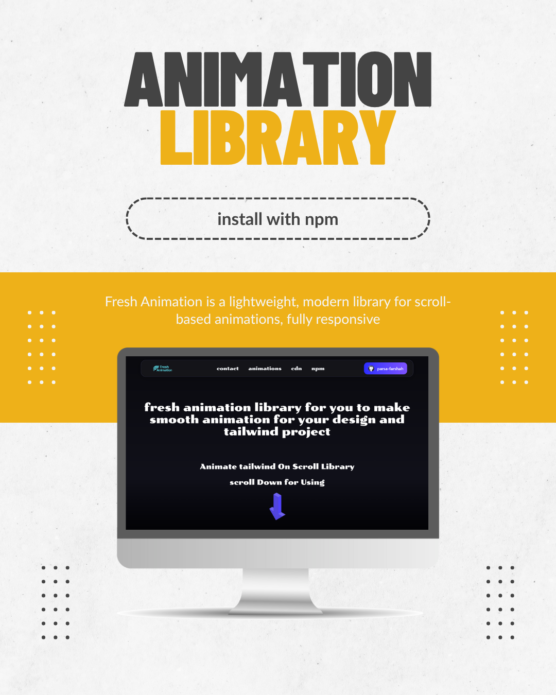
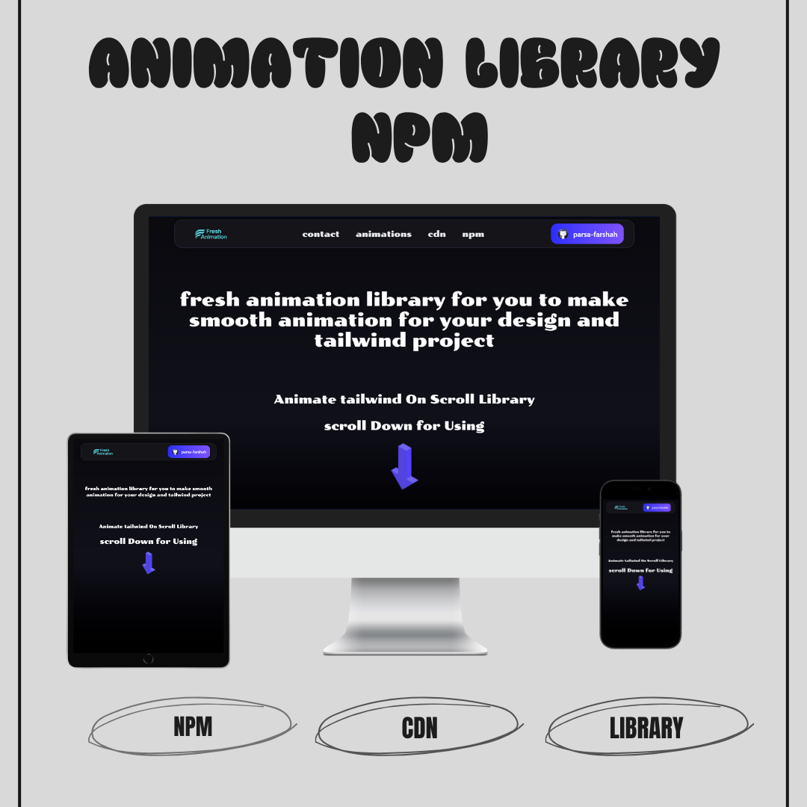

# 🎬 Fresh Animation Library v1.0.5

A lightweight and modern **JavaScript animation library** that triggers smooth scroll-based animations on your website.  
Inspired by AOS but optimized for **performance, simplicity, and flexibility**.

---

## 🚀 Overview

**Fresh Animation** allows developers to animate elements as they enter the viewport.  
Use it with **NPM** or **CDN**, fully responsive, and works seamlessly with **Tailwind CSS** or any frontend framework.

---

## 🌐 Live Demo

👉 [View Live Demo](https://parsa-farshah.github.io/Fresh-Animation-Library/)

---

## ✨ Features

- ⚡ Lightweight, dependency-free (Vanilla JS)
- 🌀 Scroll-based animations with ease
- 🎨 Prebuilt animation presets for quick integration
- 🔧 Works via **NPM** or **CDN**
- 🧩 Fully responsive, mobile-friendly
- 🪶 Compatible with Tailwind CSS and any custom styling

---

## 📅 Release Date

**October 11, 2025**

---

## 🛠️ Technologies Used

- **HTML5** – semantic markup
- **CSS3** – custom styling and animation classes
- **Tailwind CSS** – for utility-first styling
- **JavaScript** – triggers scroll-based animations
- **Media Queries** – ensures responsiveness

---

## 🎨 Available Animations

| Animation Class | Description                 |
| --------------- | --------------------------- |
| `fadeUp`        | Fade in and move up         |
| `fadeDown`      | Fade in and move down       |
| `fadeLeft`      | Fade in from left           |
| `fadeRight`     | Fade in from right          |
| `fadeUpLeft`    | Fade in diagonally up-left  |
| `fadeUpRight`   | Fade in diagonally up-right |
| `flipLeft`      | Rotate Y 90° from left      |
| `flipRight`     | Rotate Y -90° from right    |
| `flipUp`        | Rotate X -90° up            |
| `flipDown`      | Rotate X 90° down           |
| `zoomIn`        | Scale in from 0             |
| `zoomInUp`      | Scale in + move up          |
| `zoomInDown`    | Scale in + move down        |
| `zoomInLeft`    | Scale in + move left        |
| `zoomInRight`   | Scale in + move right       |

---

## 📦 Installation

📸 Project Screenshots  
🌟 Overview  


💻 Website View  


👨‍💻 Developed By

[parsa dehghan pour farashah](http://linkedin.com/in/parsa-dehghan-pour-farashah-85ab04250)

## 👨‍🏫 Supervisor

- This project was completed under the guidance of my academic supervisor:  
  🔗 [Parsa Ghorbanian's Website](https://trainingsitedesign.ir/)

- thanks to 🔗 [mehrab Pour zakaria's Website](https://pourzakaria.com/) for helping upload to the npm site

## 📲 Connect with Me | ارتباط با من

- 📸 Instagram: [@parsa_dehghanpour_dv](https://www.instagram.com/parsa_dehghanpour_dv?igsh=eHkwNWhsa3I4ZWVp)

- 💼 LinkedIn: [parsa dehghan pour farashah](http://linkedin.com/in/parsa-dehghan-pour-farashah-85ab04250)

- 💻 GitHub: [parsa-farshah](http://github.com/parsa-farshah)

- 📩 Email: parsafarashah2002@gmail.com

- 📺 YouTube: [@FrontEndFresh](https://youtube.com/@frontendfresh?si=-2WsIYe-KBTUfwyu)

---

### 🔹 Using NPM

```bash
npm install fresh-animation

html

Copy code

<link rel="stylesheet" href="node_modules/fresh-animation/dist/fresh.min.css"/>
<script src="node_modules/fresh-animation/dist/fresh.min.js"></script>


🔹 Using CDN

html

Copy code

<link rel="stylesheet" href="https://unpkg.com/fresh-animation@1.0.1/dist/fresh.min.css">
<script src="https://unpkg.com/fresh-animation@1.0.1/dist/fresh.min.js"></script>


⚙️ Usage Example
Add the data-fresh attribute to elements:


html
Copy code

<div data-fresh="fadeUp">
  <h2>Hello, Fresh Animation!</h2>
</div>

🏷️ License
Released under the MIT License.
```
